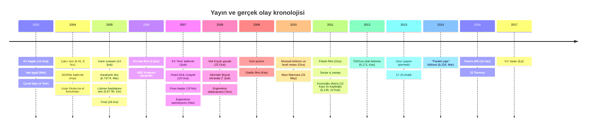
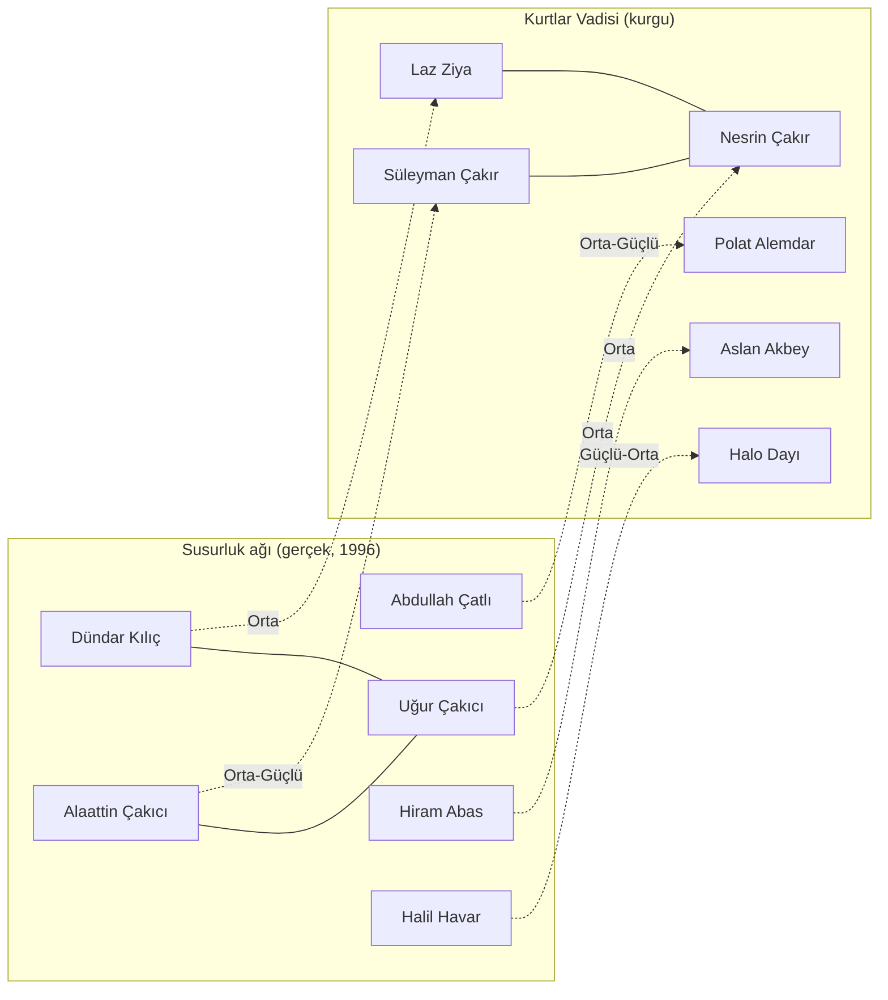

# Kurtlar Vadisi ↔ Gerçek Hayat Eşleştirme Şeması

Açık kaynak (OSINT) yöntemiyle derlenmiş, kaynaklı bir karşılaştırma raporu.
Kapsam: *Kurtlar Vadisi* (2003–2005, 97 bölüm), *Kurtlar Vadisi Terör* (2007, 2 bölüm),
*Kurtlar Vadisi Pusu* (2007–2016, 300 bölüm) ve dört sinema filmi.

Derleme tarihi: 13 Eylül 2026.

> **Önemli uyarı.** Bu rapordaki "gerçek kişi" eşleştirmelerinin neredeyse hiçbiri yapımcılar
> tarafından doğrulanmamıştır. Yapımcılar (Osman Sınav, Bahadır Özdener, Raci Şaşmaz) kişi bazlı
> esinlenmeyi açıkça reddetmiş; yalnızca konsept danışmanı Soner Yalçın "Susurluk'u yapalım,
> gerçek hayattan besliyorum" demiştir. Eşleştirmeler basın, sözlük ve fan iddialarıdır; hiçbiri
> hakkında adı geçen gerçek kişiler için suçlama veya olgu tespiti olarak okunmamalıdır.

---

## 1. Yöntem ve kanıt ölçeği

Her eşleştirme üç soruya göre puanlandı:

1. **İddiayı kim kurdu?** Yapımcı / danışman / ilgili ailesi / basın / sözlük-forum.
2. **Örtüşme türü nedir?** İsim, olay, ilişki ağı, zamanlama.
3. **Yapımcı ne dedi?** Doğruladı / reddetti / sessiz.

| Derece | Anlamı |
|---|---|
| **Güçlü** | Yapımcı, danışman ya da doğrudan ilgili kişi beyanı + belirgin isim/olay örtüşmesi |
| **Orta** | Belirgin isim/olay örtüşmesi, fakat yalnızca basın veya sözlük iddiası |
| **Zayıf** | Yalnızca forum/fan teorisi; örtüşme genel arketip düzeyinde |
| **Yok** | Taranan kaynaklarda hiçbir iddia bulunamadı |

Kaynak sınırlaması: kurtlarvadisi.fandom.com, Ekşi Sözlük ve bazı forumlar bu ortamdan
erişilemedi; bu sitelerden yalnızca arama özetleri kullanıldı. "?" işaretli bölümler için
olay bazlı güvenilir kaynak yoktur.

---

## 2. Yapım kronolojisi (doğrulanmış)

| Yapım | Yayın | Kanal | Bölüm | Senaryo / Yönetim | Yapım şirketi |
|---|---|---|---|---|---|
| Kurtlar Vadisi S1 | 15 Oca – 18 Haz 2003 | Show TV | 1–20 | Şaşmaz, Özdener (+Yurdakul 1–6); yön. Osman Sınav | Sinegraf |
| Kurtlar Vadisi S2 | 2 Eki 2003 – 24 Haz 2004 | Show TV | 21–55 | + Mehmet Turgut; yön. Sınav / M. Ş. Doğan | Sinegraf |
| Kurtlar Vadisi S3 | 23 Eyl 2004 – 9 Haz 2005 | Show TV | 56–86 | yön. Serdar Akar | Pana Film |
| Kurtlar Vadisi S4 | 6 Eki – 29 Ara 2005 | Kanal D | 87–97 | yön. Serdar Akar | Pana Film |
| KV Irak (film) | 3 Şub 2006 | Sinema | – | yön. Serdar Akar | Pana Film |
| KV Terör | 8 Şub 2007; 2. bölüm 18 Eki 2007 | Show TV | 2 | yön. Sadullah Şentürk | Pana Film |
| KV Pusu S1–3 | 19 Nis 2007 – 11 Haz 2009 | Show TV | 1–63 | Şaşmaz, Özdener, Aysan | Pana Film |
| KV Pusu S4 | 24 Eyl 2009 – 3 Haz 2010 | Star TV | 64–93 | | |
| KV Gladio (film) | 20 Kas 2009 | Sinema | – | yön. Sadullah Şentürk | |
| KV Pusu S5 | 23 Eyl 2010 – 9 Haz 2011 | atv | 94–128 | | |
| KV Filistin (film) | 28 Oca 2011 | Sinema | – | yön. Zübeyr Şaşmaz | |
| KV Pusu S6 | 22 Eyl 2011 – 7 Haz 2012 | TNT | 129–161 | | |
| KV Pusu S7–8 | 13 Eyl 2012 – 12 Haz 2014 | atv | 162–229 | | |
| KV Pusu S9–10 | 18 Eyl 2014 – 16 Haz 2016 | Kanal D | 230–300 | | |
| KV Vatan (film) | 28 Eyl 2017 | Sinema | – | yön. Serdar Akar | |

Not: Soner Yalçın ve Ömer Lütfi Mete yalnızca 2003–2005 döneminde "senaryo ve konsept danışmanı"
olarak geçer; senarist değildir (Vikipedi bölüm listesi, Özdener 2013 röportajı).

---

## 3. Karakter ↔ gerçek figür şeması

### 3.1 Kurtlar Vadisi (2003–2005)

| Karakter | İddia edilen gerçek figür | Örtüşme | İddia sahibi | Yapımcı tutumu | Derece |
|---|---|---|---|---|---|
| Polat Alemdar / Ali Candan | **Abdullah Çatlı** | Sahte kimlik, "devlet için çalışan sivil", Susurluk ağı; Çatlı'nın kızı Gökçen (2005) ve kardeşi Zeki (2009) anıların kullanıldığını söyledi | Çatlı ailesi, basın | Sınav: "hiç ilgisi yok"; Özdener: "organik bağ yok"; Necati Şaşmaz: "Polat benden esinlendi" | **Orta–Güçlü** |
| Polat Alemdar | Sedat Peker | Fan teorisi; Polat'ın Mülkiye mezunu istihbaratçı profili uymuyor | Ekşi Sözlük | Yorum yok | Zayıf |
| Süleyman Çakır | **Alaattin Çakıcı** | İsim; Nesrin–Laz Ziya üçgeni Uğur Çakıcı–Dündar Kılıç ilişkisini kopyalar; Oktay Kaynarca Çakıcı'yı çocukluğundan tanıdığını kabul etti | Basın/sözlük | Doğrulama yok; Yalçın: "tetikçiydi, kullanıldı, öldü" | **Orta–Güçlü** |
| Nesrin Çakır | Uğur Çakıcı (Dündar Kılıç'ın kızı, 1995'te öldürüldü) | Akrabalık kurgusu birebir | Basın | Sessiz | Orta |
| Laz Ziya | **Dündar Kılıç** | Trabzon kökeni, Çakır'ın kayınpederi | Basın, F. Arslan kitabı | Sessiz | Orta |
| Mehmet Karahanlı (Baron) | Rahmi Koç / Tuncay Özilhan / İnan Kıraç (Sedat Peker'in iddiası) | Konsensüs yok | Forum, Peker | Sessiz | Zayıf |
| Aslan Akbey | **Hiram Abas** (1990'da öldürülen MİT'çi); alt: Korkut Eken | "Efsane istihbaratçı", suikastla ölüm | Vikipedi, forum | Sessiz | Orta |
| Doğu Eşrefoğlu ("Doğu Bey") | Mehmet Fuat Doğu (eski MİT müsteşarı); helikopter ölümüyle Eşref Bitlis | İsim ("Doğu", "Eşref") | Forum | Sessiz | Zayıf–Orta |
| Nizamettin Güvenç | Aydoğan Semizer (Çakıcı kaset skandalı avukatı) | Avukat-danışman rolü | Basın | Sessiz | Zayıf–Orta |
| Memati Baş | Muradi Güler (Çakıcı'nın koruması); alt: Haluk Kırcı | Sadık tetikçi arketipi | Sözlük | Sessiz | Zayıf |
| Abdülhey Çoban | Ali Yasak (Drej Ali) | Arketip | Sözlük | Sessiz | Zayıf |
| Testere Necmi | Yaşar Avni Musullulu | Uyuşturucu kaçakçılığı | Forum | Sessiz | Zayıf |
| Tombalacı Mehmet | Ali Fevzi Bir ("kumarhaneler kralı") | Kumarhane motifi | Forum | Sessiz | Zayıf–Orta |
| Pala (Tarık) | Korkut Eken / Tarık Ümit / Cem Ersever / "Yeşil" | Dört farklı aday: iddia zayıf | Forum, F. Arslan | Sessiz | Zayıf |
| Halil İbrahim Kapar (Halo Dayı) | **Halil Havar** (1991'de Hollanda'da cezaevinden helikopterle kaçırıldı) | İsim + olay birebir | Vikipedi, Ekşi Şeyler | Sessiz | **Güçlü–Orta** |
| İplikçi Nedim | Nesim Malki (tefeci, 1995'te öldürüldü) | Tefecilik | Vikipedi | Sessiz | Orta |
| Hüsrev Ağa | Abuzer Uğurlu | Kaçakçılık babası | Basın, F. Arslan | Sessiz | Orta |
| Kılıç | Nihat Akgün | – | Basın | Sessiz | Zayıf |
| Kirve | Sedat Bucak | – | F. Arslan | Sessiz | Zayıf |
| Elif Eylül | Şeyda Yıldırım (Çakıcı'nın avukatı) | Avukat | Forum | Sessiz | Zayıf |
| Şevko | İbrahim Telemen; "konuşmak istediği gazeteci" → Uğur Mumcu | – | F. Arslan | Sessiz | Zayıf |
| Samuel Vanunu | Üzeyir Garih (2001'de öldürülen iş insanı) | İş insanı, ölüm | Sözlük | Sessiz | Zayıf–Orta |
| Güllü, Cevat, Duran Emmi, Seyfo Dayı, Erhan Ufak | – | – | – | – | Yok |
| "Kara Halil", "Kilyoslu", "Tuncer Doğu" | Bu adlarla karakter bulunamadı (muhtemelen Halo Dayı / Tuncay Kantarcı + Doğu Bey karışması) | – | – | – | Yok |

### 3.2 Kurtlar Vadisi Pusu (2007–2016)

| Karakter | İddia edilen gerçek figür | Örtüşme | İddia sahibi | Yapımcı tutumu | Derece |
|---|---|---|---|---|---|
| İskender Büyük | **Veli Küçük** | Soyadı tersleme (Büyük/Küçük), asker kökeni, el öptürme; Küçük 22 Oca 2008'de gözaltına alındı, karakter 7 Şub 2008'de ekrana geldi | Haber7, izleyici | Özdener 2009/2010: reddetti | **Orta–Güçlü** |
| İskender Büyük | Cem Uzan / Uzan Grubu | Hiçbir kaynak bulunamadı | – | – | Yok |
| Kara (Mazhar Yıldıran) | Mahmut Yıldırım "Yeşil" | Renk lakabı, faili meçhuller | Vikipedi | Sessiz | Orta |
| Palaska Zafer | Muzaffer Tekin | Ergenekon sanığı; Tekin mahkemede "iddianame diziyle örtüşüyor" dedi | Vikipedi, Tekin | Sessiz | Orta |
| Mete Aymar | Mehmet Eymür | Eski MİT'çi; Eymür diziyi "gerçekçi değil" diye eleştirdi | Vikipedi | Sessiz | Orta |
| Kazım Kaşifoğlu | **Kaşif Kozinoğlu** | Kozinoğlu 12 Kas 2011'de Silivri'de öldü; Kaşifoğlu 10 Kas 2011'de hücrede enjeksiyonla öldürüldü. 2026'da savcılık senaristleri "bilgi sahibi" olarak ifadeye çağırdı | Vikipedi, basın | İfadeye çağrıldı (Euronews, 13 Eyl 2026) | **Güçlü** (isim + zamanlama) |
| Davut Tataroğlu | Aydın Doğan | Medya patronu arketipi | Sözlük, Zaman | Sessiz | Zayıf–Orta |
| Celal Karacadağ / Turan Kaçgar | Rahmi Koç / Bülent Eczacıbaşı | Sanayici arketipi | Sözlük | Sessiz | Zayıf |
| Tuncay Kantarcı | Tuncay Mataracı | İsim | Onedio | Sessiz | Zayıf |
| Muhterem Bey (b.218) | Fethullah Gülen | Bölüm doğrudan 17-25 Aralık göndermesi | Basın | İnkâr yok | **Güçlü** |
| Savcı (b.218) | Zekeriya Öz | Görsel benzerlik | Basın | İnkâr yok | Orta |
| Mustafa Dinç | Alparslan Arslan (Danıştay saldırganı) | Olay | Vikipedi | Sessiz | Orta |
| Muro | Belirli kişi yok; PKK metropol yapılanması / açılım tartışması | Tema | Basın, akademi | – | Tema düzeyi |
| Meclis / Kare As / Aksaçlı / Tapınakçılar / Karun | Bilderberg, Gladio, "küresel derin devlet" temaları | Tema | Senaristler | Tema düzeyinde sahiplenildi | Tema düzeyi |
| Vural, Ömer Candan, Zaza, Dündar Erol, Hızır, Leon, Şahin | – | – | – | – | Yok |

Şemanın okunuşu: gerçek hayatta Çakıcı, Dündar Kılıç'ın kızı Uğur ile evliydi ve 1995'te
Uğur Çakıcı öldürüldü. Dizide Çakır, Laz Ziya'nın kızı Nesrin ile evlidir. Bu ilişki ağı
eşleştirmelerin en güçlü yapısal kanıtıdır; tek tek isimlerden çok ağın kopyalanmış olması dikkat çekicidir.

---

## 4. Kurtlar Vadisi (1–97): bölüm bölüm olay ve gerçek hayat karşılaştırması

Sütunlar: bölüm, dizideki ana olay, olası gerçek hayat karşılığı, karşılaştırma notu, derece.
"—" = anlamlı bir gerçek hayat paraleli iddia edilmemiş; "?" = bölüm özeti kaynağı zayıf.

### 1. Sezon (b.1–20): Şevko / Duran Emmi / kumarhane

| B. | Dizideki olay | Gerçek hayat karşılığı | Karşılaştırma | Derece |
|---|---|---|---|---|
| 1 | Ali Candan sahte kazayla "ölür"; Çakır konsey emriyle üç cinayet işler | Çatlı'nın "Mehmet Özbay" sahte kimliği; Zeki Çatlı'ya göre tren kazası anekdotu | Dizide devlet eliyle kimlik sıfırlama; gerçekte Çatlı firari olarak sahte kimlik kullandı | Orta |
| 2 | Estetik ameliyatla Polat Alemdar doğar | Gerçek karşılığı yok | Dramatik araç | — |
| 3 | Konsey kumarhane iznini Çakır'a verir | 1998'de Türkiye'de kumarhanelerin kapatılması; Ali Fevzi Bir dönemi | Dizi 2003'te yasadışı kumarhane düzenini anlatır; gerçekte kumarhaneler 5 yıl önce kapatılmıştı | Zayıf |
| 4–5 | Şevko'nun Elif'e suikastı; Şevko–Çakır düşmanlığı | Mafya içi bölge kavgaları (genel) | — | — |
| 6 | Akbey, Duran Emmi'yi öldürür; suç Şevko'ya kalır | "Derin devletin sivil ölümleri kullanması" teması (Susurluk raporlarındaki faili meçhul tartışması) | Tema düzeyinde | Zayıf |
| 7 | Polat, Şevko'nun adamına Çakır'ı vurdurur; savaş başlar | — | Provokasyon motifi | — |
| 8 | Meral, uyuşturucu etkisiyle babası Laz Ziya'yı vurur | — | — | — |
| 9 | Laz Ziya kızının infazını ister | Dündar Kılıç'ın "raconu" (basında sık anlatılan sertlik) | Genel arketip | Zayıf |
| 10 | Kuzey Irak'a uçaksavar kaçakçılığı konuşulur | **Irak işgali (20 Mart 2003)** ve Kuzey Irak'a silah akışı tartışmaları | Bölüm Mart–Nisan 2003'te yayınlandı; doğrudan güncel gündem | Orta |
| 11–12 | Polat kaçırılır; Akbey'in "Emin İzzet" kurtarma operasyonu | — | — | — |
| 13 | Polat, Nakliyeci Sefer'i öldürür; Şevko öldürülür | — | Kaynaklar Şevko'yu kimin öldürdüğünde çelişik (Memati vs Akbey) | — |
| 14 | Nizamettin tarihi eser kaçakçılığına izin alır | Türkiye'de tarihi eser kaçakçılığı davaları (genel) | Tema | Zayıf |
| 15 | Tuncay–Erdal SARS maskesi ticareti; Seyfo vurulur | **SARS salgını (Mart–Haz 2003)** | Doğrudan güncel olay | Orta |
| 16–17 | Tuncay'ın arabası taranır; Tombalacı'nın işi olduğu anlaşılır | — | — | — |
| 18 | Teşkilatın 2. adamı Ufuk Bey "intihar" eder | Şüpheli intihar/ölümler (Tarık Ümit'in 1995'te kaybolması gibi) tartışmaları | Tema | Zayıf |
| 19 | Akbey'in adamları CIA ajanını öldürür | — | ABD karşıtı ton ilk kez; 2006 Irak filminin öncülü | Zayıf |
| 20 | Erdal, Hikmet'i vurur; kumarhane taranır | — | Sezon finali | — |

### 2. Sezon (b.21–55): Hapisteki Çakır / Tombalacı / Cerrahpaşalı / Çakır'ın ölümü / Ruslar

| B. | Dizideki olay | Gerçek hayat karşılığı | Karşılaştırma | Derece |
|---|---|---|---|---|
| 21 | Kumarhane katliamı (32 ölü), Derya ölür; Çakır tutuklanır | Çakıcı'nın 1998'de Fransa'da yakalanması / hapis dönemi | Çakıcı fiilen yurt dışında tutuklandı; dizi İstanbul'da tutuklatır | Zayıf |
| 22–24 | Tombalacı, Çakır'ı hapiste öldürtmeye çalışır; Çakır koğuşta tacizciyi öldürür | Türk cezaevlerinde mafya liderlerinin koğuş hâkimiyeti haberleri (genel) | Tema | Zayıf |
| 25–27 | Testere profesörleri öldürür; Çakır polis kıyafetiyle bir geceliğine çıkar | — | — | — |
| 28 | Memati tanığı öldürür | Tanık korumanın yokluğu; Susurluk davasında tanık sorunları | Tema | Zayıf |
| 29 | Çakır, Ferman'ı öldürür; savcı ve tanık **DGM önünde** vurulur | DGM'ler Haziran 2004'te kaldırıldı; bölüm Aralık 2003 | Dizi son DGM dönemini yansıtır | Zayıf |
| 30–33 | Seyfo kendini feda eder; Memati yakalanır; Çakır 6 ay sonra tahliye | — | — | — |
| 34–35 | Ester Risch (İsrailli) Polat'ı kaçırır; Akbey İsraillilere operasyon | Mossad'ın Türkiye'deki faaliyetleri tartışmaları | İsrail teması 2010 Pusu krizine kadar sürekli | Zayıf |
| 36 | Çakır, Tombalacı'yı öldürür; Karahanlı "Ruslarla iş yaptı" der | Rus mafyasının 1990'larda Türkiye'ye girişi | Tema | Zayıf |
| 37–41 | Cerrahpaşalılar; Polat Meto'yu öldürür; Halit intikam | Karagümrük/Cerrahpaşa çevresi semt çeteleri (Nuriş kardeşler basında anılır) | Belirli kişi eşleştirmesi bulunamadı | Zayıf |
| 40 | Erdal, babası Abuzer'i zehirli iğneyle öldürür | — | — | — |
| 42 | Rus baron Ivanov, Karahanlı'ya suikast girişimi | — | — | — |
| 43 | Konsey Çakır'ın "kalemini kırar"; Çakır pusuda vurulur | Çakıcı **hayatta** (2004'te cezaevinde) | **Ayrışma**: dizi Çakır'ı öldürür; Yalçın "Peker/Çakıcı ile uygunsuz ilişki" imasıyla karakterin çıkarıldığını söyledi | Orta (ayrışma) |
| 45 | **Çakır ölür (8 Nis 2004)**; Polat 6 babayı infaz eder; Memati Halit'i boğar | — | Sınav: ölüm baştan planlıydı | — |
| 46–48 | Laz Ziya Orhan'a intihar emri; Akbey "Nasibim-1" için derin devlete hesap verir | "Devlet içinde devlet" teması (Susurluk komisyonu raporu, 1997) | Tema | Zayıf |
| 49–51 | "Şanslı-S" uyuşturucu operasyonu; Kirkor öldürülür; Pala malı çalar | Devlet operasyonlarında ele geçen malın kaybolması iddiaları (Susurluk raporlarında) | Tema | Zayıf |
| 52 | **Nesrin, Meral'i vurur** | Uğur Çakıcı'nın 1995'te öldürülmesi (Çakıcı emriyle) | Dizide Laz Ziya'nın kızı öldürüyor; gerçekte Dündar Kılıç'ın kızı öldürüldü. Rol tersine çevrilmiş | Orta (tersleme) |
| 53 | Ruslarla orman çatışması | — | — | — |
| 54 | Canan, Erdal'ı vurur | — | — | — |
| 55 | **Aslan Akbey öldürülür** | **Hiram Abas suikastı (26 Eyl 1990, Dev-Sol)** | Dizide "okyanus ötesi" emir; gerçekte sol örgüt. Fail ayrışıyor, "efsane istihbaratçının suikastı" motifi örtüşüyor | Orta |

### 3. Sezon (b.56–86): Akbey sonrası / Halo / Karahanlı'nın ölümü / Baronluk / Tapınakçılar

| B. | Dizideki olay | Gerçek hayat karşılığı | Karşılaştırma | Derece |
|---|---|---|---|---|
| 56 | Testere bombayla ölür; Polat Necmi'nin yerine geçer | — | — | — |
| 57–58 | "30 yıllık sır"; Akbey'in kara defteri | Susurluk sonrası "kara kutu"/"kirli dosya" söylemi | Tema | Zayıf |
| 59 | **Kılıç, Hüsrev Ağa'yı kılıçla öldürür** | Abuzer Uğurlu 2005'te hayatta | **Ayrışma** | — |
| 60 | Güç boşluğu | — | — | ? |
| 61–62 | **Halo Dayı hapisten helikopterle kaçırılır** | **Halil Havar, 1991, Leeuwarden (Hollanda) cezaevinden helikopterle kaçırıldı** | Olay neredeyse birebir; yalnızca ülke değiştirilmiş | **Güçlü–Orta** |
| 63–64 | Pala, Seyfo'yu vurur; Seyfo ölür | — | — | — |
| 65–72 | Kaynak zayıf (TMDB özetleri) | — | — | ? |
| 73 | Polat'ın Efe Yakup Karahanlı olduğu ortaya çıkar | — | — | — |
| 73/74 | **Baron Karahanlı Tapınakçı tarafından öldürülür** | Eşleştirilen iş insanları (Koç, Kıraç, Özilhan) hayatta | **Ayrışma**; bölüm numarası kaynaklarda çelişik | — |
| 75–79 | Konsey baron seçer; Polat Baron olur; Kirve ölür | — | — | — |
| 80 | Samuel'in CD'si; ekonomi ve hükûmet manipülasyonu | 2001 krizi sonrası "sermaye–siyaset" tartışmaları | Tema | Zayıf |
| 81–84 | Kaynak zayıf | — | — | ? |
| 85 | **Samuel Vanunu bombayla öldürülür** | Üzeyir Garih 2001'de bıçaklanarak öldürüldü | Yöntem farklı; "öldürülen Yahudi iş insanı" motifi örtüşüyor | Zayıf–Orta |
| 86 | **Doğu Bey'in helikopteri sabotajla düşer** | **Eşref Bitlis, 17 Şub 1993, uçak kazası (sabotaj iddiaları)** | Dizide helikopter, gerçekte uçak; "şüpheli hava kazası" motifi | Zayıf–Orta |

### 4. Sezon (b.87–97, Kanal D): Suriye / Lübnan / Kripteks / Amon

| B. | Dizideki olay | Gerçek hayat karşılığı | Karşılaştırma | Derece |
|---|---|---|---|---|
| 87 | Polat Suriye'de diri gömülmüş bulunur; Elif'e "kaza" | — | — | — |
| 88–90 | **Polat'a Lübnan Başbakanı'na suikast görevi dayatılır; engeller** | **Refik Hariri suikastı (14 Şub 2005, Beyrut)** ve Suriye'nin sorumlu tutulması | Bölümler Ekim 2005'te yayınlandı; senaryo aynı yılın en büyük Ortadoğu olayını tersine çevirir (suikast engellenir) | **Orta** |
| 91–93 | "Türkiye'nin Kara Kutusu"; Nizamettin Küresel Konsey ile temas | "Derin devlet arşivi" söylemi | Tema | Zayıf |
| 94–95 | Nizamettin, Kılıç'ı öldürür; **Laz Ziya hapiste şişlenir** | Dündar Kılıç 1999'da kalp yetmezliğinden öldü | **Ayrışma** | — |
| 96 | Polat Los Angeles'ta Dünya Baronu Amon ile görüşür; **Nizamettin asılır, cesedi Dikilitaş'a asılır** | — | Küresel komplo anlatısı; Pusu'nun Meclis/Tapınakçılar hattının tohumu | — |
| 97 | Elif ölür; Polat ve ekibi teslim olup **beraat eder** | Susurluk davası (2001) ve Çatlı çevresinin yargılanması; Ağar'ın uzun süre yargılanamaması | Dizi devlet operasyonunu meşrulaştırıp aklar; gerçek davalar mahkûmiyetle bitti (Eken, İbrahim Şahin) | Zayıf |

---

## 5. Kurtlar Vadisi Terör (2007)

| Bölüm | Olay | Gerçek hayat | Not |
|---|---|---|---|
| 1 (8 Şub 2007) | PKK/terör teması; "kanlı sürecin 300 milyar dolarlık maliyeti" söylemi | Hrant Dink cinayeti sonrası (19 Oca 2007) gergin ortam; RTÜK'e 16.597 başvuru | Show TV bir bölümden sonra kaldırdı; Pana Film "fiili sansür" dedi |
| 2 (18 Eki 2007) | Sekiz ay sonra tek bölüm | — | Vikipedi'deki "Çözüm Süreci nedeniyle kaldırıldı" ifadesi anakronik (süreç 2013); kaynaksız |

---

## 6. Kurtlar Vadisi Pusu (1–300): sezon ve arc bazında karşılaştırma

Pusu'da bölüm başına özet kaynağı yoktur; eşleştirme arc düzeyindedir. Bölüm aralıkları yaklaşıktır.

| Sezon / bölüm | Dizideki ana hat | Gerçek olay veya tartışma | Bağı kim kurdu | Yapımcı tutumu | Derece |
|---|---|---|---|---|---|
| S1 (1–9) | Çağrı Toros suikastı; "Kare As" / Meclis: Türkiye'yi yöneten dört aile; Polat KGT başına geçer | "Sermaye–derin devlet" teması; Koç/Sabancı/Uzan isimleri yalnızca forumlarda | Fan | Senaristler: "iş dünyasının devlet içi çetelerle ülkeyi yönetişini anlatmak istedik" | Tema: Orta; kişi: Zayıf |
| S2 (10–41) | Vural'ın darbe girişimi; Muro (b.13, Eki 2007) PKK metropol sorumlusu; Palaska Zafer (b.11); **İskender Büyük** (b.25, 7 Şub 2008); Abdülhey'e "Filistin askısı" | **Ergenekon operasyonu (Haz 2007–)**, Veli Küçük gözaltısı (22 Oca 2008), Muzaffer Tekin; Filistin askısı → 1980 darbesi sonrası işkence yöntemi | Haber7, Yüksel Aytuğ (Sabah), sanık Tekin | Özdener: Küçük ile bağ yok; ancak "kare kare anlattık, sonra hepsi gerçek çıktı" | Orta–Güçlü |
| S3 (42–63) | İskender'in yükselişi; füze/teknoloji; Polat tutsak; Muro canlı bomba olarak ölür (1 Eki 2009) | Ergenekon iddianamesi (Tem 2008): Mumcu, Gazi, Madımak, Santoro, Dink, Zirve baskını kalemleri | Aytuğ 2008: "iddianamedeki olaylar dizide işlenmişti" | Sessiz | Orta |
| S4 (64–93, Star TV) | **Mossad'ın Türk çocuğu kaçırması, İsrail elçiliği baskını (Oca 2010)**; Aron Feller (CIA/Gladio); İskender asılır (b.93) | **İsrail Dışişleri Büyükelçi Çelikkol'u çağırdı; "alçak koltuk" krizi (Oca 2010)** | İsrail hükûmeti | Pana Film: "İsrail BM raporlarınca savaş suçlusu ilan edildi" | **Güçlü** (gerçek diplomatik sonuç doğurdu) |
| S4 | Başbakan–özel kalem ve MGK brifing sahneleri (Ara 2009) | **Kürt açılımı (2009)**; Muro'nun "sempatikleştirilmesi" tartışması | İnternethaber, Milliyet, akademik makale | Sessiz | Orta |
| S5 (94–128, atv) | Aron Feller nükleer bomba peşinde; Kazım Kaşifoğlu (b.123–139); Doğu Bey / derin devlet; Mete Aymar | Kaşif Kozinoğlu'nun Ergenekon'dan tutuklanması (2011); Mehmet Eymür | Vikipedi, basın | Eymür: "gerçekçi değil" | Orta |
| S6 (129–161, TNT) | Memati vurulur; Feller öldürülür (b.131); **Kaşifoğlu hücrede enjeksiyonla öldürülür (b.139, 10 Kas 2011)**; Kara girer; Suriye teması başlar | **Kozinoğlu Silivri'de ölür (12 Kas 2011)**; Suriye iç savaşı (Mar 2011–) | Basın; 2026'da Silivri Başsavcılığı | Senaristler 2026'da "bilgi sahibi" olarak ifadeye çağrıldı | **Güçlü** (zamanlama iki gün) |
| S7 (162–195, atv) | Aksaçlı / İhtiyarlar Heyeti; Tapınakçılar ve Soy Kitabı; **Polat ÖSO'ya silah verir (b.171, 22 Kas 2012)**; Polat kendi infazını yaptırır | **Türkiye'nin Suriye muhalefetine desteği (2012)**; 2024'te "Suriye bayrağı kehaneti" iddiası Teyit ve Doğrula tarafından yanlışlandı | Basın, sosyal medya | Özdener: "gündemi takip ediyoruz" | Orta (gündem takibi); "kehanet": Yanlış |
| S8 (196–229, atv) | **b.218 (13 Mar 2014): kasetler, MİT TIR'ları, "Muhterem Bey", Zekeriya Öz'e benzeyen savcı, "paralel yapı"**; Abdülhey ölür (b.229) | **17-25 Aralık 2013 operasyonları; MİT TIR'ları (Oca 2014)** | Bölümün kendisi | İnkâr yok; eleştirmenler "dizi hükûmet anlatısına dönüştü" | **Güçlü** |
| S8 | Gezi (Haz 2013) | Diziye özel Gezi bölümü yok; Pana Film "Gezi'yi işleyeceğiz" haberlerini yalanladı | Milliyet (Koloğlu) | Yalanlama | Yok |
| S9–10 (230–300, Kanal D) | Piramit Operasyonu; Kara'ya Ebola enjekte edilir (b.232); Leyla ölür; Karun'un "Armageddon" ekibi, Büyük Konsey, Kuzuzade ailesi; Mister Ozi öldürülür (b.300) | Ebola salgını (2014); küresel komplo anlatıları | Fan | Sessiz | Zayıf |

**Balyoz:** Dizi Balyoz'u işlemedi. Tersine, 3. Balyoz iddianamesindeki "ilişiği kesilecek sağ görüşlü öğrenciler" listesinde Zübeyr Şaşmaz'ın adı çıktı (Ara 2011). Bu, dizi ekibinin gerçek davalarda edilgen özne olarak yer aldığı iki vakadan biridir (diğeri Kozinoğlu soruşturması).

**Şemdinli, Dağlıca, Ceylan Önkol, Uzan Grubu:** Dizi ile bağ kuran hiçbir basın kaynağı bulunamadı.

---

## 7. Filmler

| Film | Dizideki anlatı | Gerçek olay | Bağ kaynağı | Tepkiler | Derece |
|---|---|---|---|---|---|
| **Irak (2006)** | Süleymaniye'de Türk askerlerinin başına çuval geçirilmesiyle açılış; Sam Marshall; düğün katliamı; organ ticareti | **Çuval olayı (4 Tem 2003)**, Ebu Garib, Mukaradeeb düğün katliamı (2004), Daniel Pearl | Filmin kendisi | Arınç: "aynen böyle oldu"; ABD Kongresi (Weldon, Mar 2006); ABD Ordusu personel uyarısı; Almanya'da CinemaxX filmi çekti; WSJ sert eleştiri | **Güçlü** (açık uyarlama) |
| **Gladio (2009)** | Susurluk dönemi; NATO Gladio; Özal, Öcalan, Bekaa, 28 Şubat, Cem Ersever; Özal ve Erdoğan'ı canlandıran oyuncular | Susurluk kazası (1996), Gladio soruşturmaları, Ergenekon davası (2008–) | Filmin kendisi | Ergenekon soruşturmasının ortasında vizyona girdi; "sosyal mühendislik" eleştirileri | **Güçlü** |
| **Filistin (2011)** | İsrail'in Gazze/Batı Şeria operasyonları; Moşe Ben Eliezer | **Mavi Marmara baskını (31 May 2010)**: senaryo baskın sonrası yeniden yazıldı | Zübeyr Şaşmaz: "intikam değil, Filistinlilerin yaşadığını göstermek" | Almanya'da 27 Ocak (Holokost Anma Günü) gösterimi tepkisi; FSK 18 | **Güçlü** |
| **Vatan (2017)** | 15 Temmuz gecesi | **15 Temmuz 2016 darbe girişimi** | Filmin kendisi | — | **Güçlü** |

---

## 8. Karşılaştırmalı bulgular

**Eşleştirme türleri üç katmana ayrılıyor.**

1. **Kişi kopyalama (2003–2005, Soner Yalçın dönemi).** Susurluk ağı (Çatlı, Çakıcı, Dündar Kılıç, Uğur Çakıcı, Hiram Abas, Halil Havar) ilişki yapısıyla birlikte aktarılmış görünüyor. Kanıt, tek tek isimlerden çok ağın ve iki olayın (Havar'ın helikopterle kaçırılması, Uğur Çakıcı cinayetinin terslenmiş hâli) örtüşmesine dayanıyor. Yapımcılar reddediyor; danışman ve Çatlı ailesi doğruluyor.

2. **Gündem takibi (Pusu, 2007–2016).** Kişi eşleştirmeleri zayıflıyor, olay eşleştirmeleri güçleniyor: Ergenekon (2008), İsrail elçiliği (2010), Suriye (2012), 17-25 Aralık (2014). Senaristler bunu "öngörü" olarak sunuyor; eleştirmenler "hükûmet anlatısı" olarak okuyor. Kaşifoğlu–Kozinoğlu örtüşmesi (iki gün fark) 2026'da resmi soruşturma konusu oldu.

3. **Açık uyarlama (filmler).** Dört film de gerçek olayları isimleriyle işliyor ve yapımcılar bunu saklamıyor.

**Sistematik ayrışmalar.** Dizi, eşleştirilen gerçek kişileri sıklıkla öldürür (Çakır, Laz Ziya, Hüsrev, Karahanlı, Nizamettin), oysa gerçek karşılıkları o tarihte hayattadır ya da farklı biçimde ölmüştür. Dizideki devlet operasyonu beraatle biter; gerçek Susurluk davası mahkûmiyetlerle bitmiştir. Bu ayrışmalar, dizinin belgesel değil "esinlenmiş kurgu" olduğunu gösteren en somut kanıttır.

**Yanlışlanan iddialar.**
- "Suriye bayrağı kehaneti" (b.171): Teyit ve Doğrula yanlışladı.
- KV Terör'ün "Çözüm Süreci nedeniyle" kaldırıldığı: anakronik.
- Çakır'ın 51. bölümde öldüğü: doğrusu 45.
- İskender Büyük = Cem Uzan: kaynak yok.

---

## 9. Boşluklar ve sonraki adımlar

- Bölüm 65–72, 78 ve 81–84 için olay bazlı kaynak bulunamadı.
- Karahanlı'nın ölüm bölümü (73 mü 74 mü) ve Akbey'in ölüm sahnesi kaynaklarda çelişik.
- Pusu 5–10. sezonların arc sınırları fan wikisi dışında kaynaksız.
- Raci Şaşmaz'ın 2023 YouTube röportajı ve Faruk Arslan'ın *Kurtlar Vadisi Fenomeni* kitabı birincil kaynak olarak taranamadı; bu ikisi eşleştirmeleri güçlendirebilir ya da çürütebilir.

---

## 10. Kaynaklar

Yapım ve bölüm bilgileri:
- https://tr.wikipedia.org/wiki/Kurtlar_Vadisi_b%C3%B6l%C3%BCmleri_listesi
- https://tr.wikipedia.org/wiki/Kurtlar_Vadisi_karakterleri_listesi
- https://tr.wikipedia.org/wiki/Kurtlar_Vadisi_Pusu
- https://tr.wikipedia.org/wiki/Kurtlar_Vadisi_Pusu_b%C3%B6l%C3%BCmleri_listesi
- https://tr.wikipedia.org/wiki/Kurtlar_Vadisi_Pusu_karakterleri_listesi
- https://tr.wikipedia.org/wiki/Kurtlar_Vadisi_Ter%C3%B6r
- https://en.wikipedia.org/wiki/Valley_of_the_Wolves_(TV_series)
- https://emirhankabakci.com/kurtlar-vadisi-ilk-97-bolum/
- https://www.themoviedb.org/tv/34587-kurtlar-vadisi
- https://www.internethaber.com/kurtlar-vadisinde-kim-nasil-oldu-foto-galerisi-1208563.htm
- https://kurtlar.wordpress.com/kurtlar-vadisi-pusu-bolum-ozetleri/

Yapımcı ve danışman beyanları:
- https://www.haberturk.com/polemik/haber/918142-geyleri-sevmem-irrite-olurum (Osman Sınav)
- https://www.hurriyet.com.tr/kelebek/biz-hic-sikici-ve-asik-suratli-insanlar-olmadik-12517829 (Özdener, Aysan, N. Şaşmaz)
- https://www.habervitrini.com/haber/kurtlar-vadisinin-konsept-danismani-soner-yalcindan-cok-konusulacak-sozler-113924 (Soner Yalçın)
- https://www.turkiyegazetesi.com.tr/gundem/89842.aspx (Özdener 2013)
- https://www.medyatava.com.tr/haber/kurtlar-vadisi-pusunun-senaristleri-konustu-polat-evlenecek-mi_36866
- https://www.ajans32.com/-kurtlar-vadisi-pusu-senaristleriyle-roportaj-546h.htm

Karakter eşleştirme iddiaları:
- https://www.haber7.com/guncel/haber/119709-polat-alemdar-abdullah-catli-mi (Gökçen Çatlı)
- https://www.gazeteciler.com/haber/polat-alemdar-aslinda-abdullah-catli/166942 (Zeki Çatlı)
- https://www.milliyet.com.tr/cadde/cakirin-sonunu-oktay-hazirladi-5102244
- https://www.medyatava.com.tr/haber/oktay-kaynarca-sedat-peker-ile-alaaddin-cakiciyi-taniyorum_3658
- https://eksiseyler.com/hapisten-helikopterle-kacirilan-muthis-turk-lakapli-uyusturucu-kacakcisi-halil-havar
- https://www.timeturk.com/tr/2012/07/16/kurtlar-vadisi-nde-kim-kimdir.html (Faruk Arslan listesi)
- https://onedio.com/haber/son-donemde-gundem-olan-kurtlar-vadisi-karakterlerinin-gercek-hayatta-temsil-ettigi-iddia-edilen-kisiler-983371
- https://www.uludagsozluk.com/k/kurtlar-vadisi-karakterlerinin-ger%C3%A7ek-kar%C5%9F%C4%B1l%C4%B1klar%C4%B1/
- https://www.haber7.com/medya/haber/299029-iskender-buyuk-veli-kucuk-mu
- https://www.sabah.com.tr/yazarlar/gunaydin/aytug/2008/07/06/kurtlar_vadisi_nasil_gercek_oldu
- https://www.milliyet.com.tr/siyaset/muzaffer-tekinden-sok-ifade-kurtlar-vadisi-ile-ergenokon-iddianamesi-ortusuyor-1016091
- https://www.ensonhaber.com/gundem/eski-mitci-mehmet-eymurden-kurtlar-vadisi-elestirisi-22182
- https://tr.euronews.com/2026/09/13/kasif-kozinoglu-sorusturmasi-kurtlar-vadisi-senaristleri-ifadeye-cagirildi

Gerçek olay bağları ve tepkiler:
- https://www.hurriyet.com.tr/gundem/kurtlar-vadisi-teror-yayindan-kaldirildi-5962756
- https://www.cumhuriyet.com.tr/haber/israilden-turkiyeye-kurtlar-vadisi-uyarisi-112096
- https://www.hurriyet.com.tr/dunya/pana-filmden-israile-yanit-13447528
- https://www.internethaber.com/kurtlar-vadisinde-kurt-acilimi-220823h.htm
- https://www.milliyet.com.tr/cadde/kurtlar-vadisi-ne-paralel-damgasi-1851882
- https://teyit.org/analiz/kurtlar-vadisi-pusuda-suriye-bayraginin-degiseceginin-ongoruldugu-iddiasi
- https://www.dogrula.org/dogrulamalar/kurtlar-vadisi-pusu-dizisinde-suriye-bayraginin-degisecegi-ongoruldu-mu/
- https://www.star.com.tr/magazin/kurtlar-vadisi-pusudan-gezi-yalanlamasi-haber-760598/
- https://www.tevhidhaber.com/kurtlar-vadisi-darbe-planinda-81689h.htm
- https://www.cnnturk.com/dunya/kongrede-kurtlar-vadisi-tartismasi-360933
- https://www.milliyet.com.tr/gundem/abdye-kurtlar-vadisi-raporu-255569
- https://en.wikipedia.org/wiki/Valley_of_the_Wolves:_Iraq
- https://en.wikipedia.org/wiki/Valley_of_the_Wolves:_Gladio
- https://en.wikipedia.org/wiki/Valley_of_the_Wolves:_Palestine
- https://tr.wikipedia.org/wiki/Kurtlar_Vadisi_Vatan
- https://www.memleket.com.tr/abdulheye-iskence-250-bin-ytl-24972h.htm (RTÜK cezası)
- https://www.veryansintv.com/kurtlar-vadisi-hangi-derin-devletmis-acikliyorum (karşı okuma)
